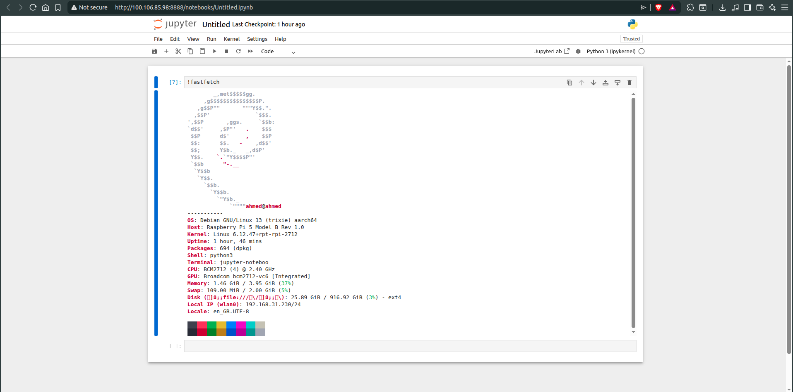

# PTB-XL Edge ECG Challenge — Full Pipeline

## 🏗️ Project Structure

```
ecg_project/
├── configs/
│   └── config.yaml              # All hyperparameters & paths
├── src/
│   ├── dataset.py               # PTB-XL dataset loader + splits
│   ├── preprocessing.py         # Signal preprocessing (filter, resample, normalize)
│   ├── augmentation.py          # ECG-specific data augmentation
│   ├── model.py                 # Lightweight 1D-CNN + Attention (MobileECG)
│   ├── train.py                 # Training loop with mixed precision
│   ├── evaluate.py              # Macro-AUC, per-class metrics
│   ├── compress.py              # Pruning + INT8 quantization
│   └── utils.py                 # Logging, seeding, helpers
├── scripts/
│   ├── run_preprocessing.py     # Step 1: preprocess raw PTB-XL
│   ├── run_training.py          # Step 2: train full model
│   ├── run_compress.py          # Step 3: prune + quantize
│   ├── run_evaluate.py          # Step 4: evaluate all variants
│   └── rpi_inference.py         # Raspberry Pi 5 real-time demo
├── image_preprocessing/
│   └── ecg_image_cleaner.py     # Your original image pipeline (enhanced)
└── requirements.txt
```

## 🚀 Quick Start

```bash
# 1. Install dependencies
pip install -r requirements.txt

# 2. Download PTB-XL dataset
# https://physionet.org/content/ptb-xl/1.0.3/

# 3. Run full pipeline
python scripts/run_preprocessing.py --data_dir /path/to/ptb-xl
python scripts/run_training.py
python scripts/run_compress.py
python scripts/run_evaluate.py

# 4. Raspberry Pi inference
python scripts/rpi_inference.py --model models/ecg_model_int8.onnx
```

## 🎯 Challenge Targets
- **Macro-AUC**: ≥ 0.90
- **Inference latency**: < 200ms on Raspberry Pi 5
- **Model size**: < 5MB

## 📊 Classes
| Label | Description |
|-------|-------------|
| NORM  | Normal ECG |
| MI    | Myocardial Infarction |
| STTC  | ST/T-wave Change |
| CD    | Conduction Disturbance |
| HYP   | Hypertrophy |


ou bien import le fichier de ecg_pipline dans le colab 

le conection de juputer dans rasspery 


le result de execution 
https://colab.research.google.com/drive/1SqHqGVevhWenbrNqxuFSum7hkK6xJnuL?usp=sharing 
puis le datasets est plus grand est le connexion tress failble le resulte de eroror fichier not found 


vido []
## 💡 Usage Notes & Demo

### Running on Google Colab
You can import and run the `ecg_pipeline.ipynb` notebook directly in Google Colab for cloud-based execution. [Colab Demo Notebook](https://colab.research.google.com/drive/1SqHqGVevhWenbrNqxuFSum7hkK6xJnuL?usp=sharing)

### Jupyter on Raspberry Pi
For local execution, you can launch Jupyter Notebook on your Raspberry Pi and run the pipeline. This is ideal for real-time inference and edge deployment.

### Important: Dataset Size & Connectivity
- The PTB-XL dataset is large (~1.7GB). If your internet connection is slow or unstable, you may encounter errors such as `file not found` during download or execution.
- For best results, download the dataset in advance and ensure the path is correctly set in your configuration files.

### Demo Video
Watch a step-by-step demo of launching Jupyter, running the pipeline in Raspberry Pi 5, and handling large datasets: click image
[](https://drive.google.com/file/d/1eq7Eoqm9WBl3ZfSKWlJ6vWOUqN5N7-QL/view?usp=sharing)